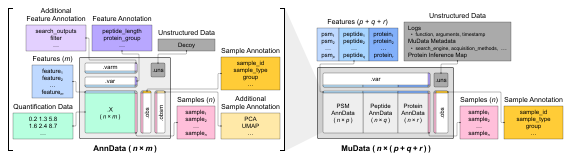
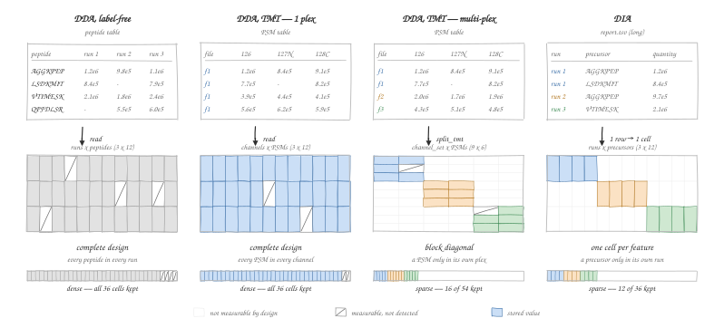

# Data in msmu

## Overview

In LC-MS/MS "shotgun" `proteomics`, data analysis typically follows a **hierarchical path**—starting from PSM-level data (PSM or precursor), progressing to peptides, and finally reaching proteins. Each stage introduces its own set of feature annotations, quantification matrices, and tool-specific metadata. As a result, shotgun proteomics data naturally form a **multi-level** and **multi-dimensional** structure: PSM/precursor, peptide, protein; feature metadata; sample annotations; and QC metrics.

To manage these properties consistently, `msmu` adopts [`MuData`](https://mudata.readthedocs.io/en/latest/) from the `scverse` ecosystem as the fundamental data format. [`MuData`](https://mudata.readthedocs.io/en/latest/), together with its constituent [`AnnData`](https://anndata.readthedocs.io/en/stable/) objects, is widely used in scRNA-seq to manage complex data matrices and their associated metadata. The same structure fits proteomics naturally: identification-level attributes, quantification values, and sample information can all be stored cleanly and explored in an integrated way.

`msmu` works with data formatted as a [`MuData`](https://mudata.readthedocs.io/en/latest/) object composed of multiple [`AnnData`](https://anndata.readthedocs.io/en/stable/) modalities.
Therefore, understanding the usage of [`MuData`](https://mudata.readthedocs.io/en/latest/) and [`AnnData`](https://anndata.readthedocs.io/en/stable/) helps when working with `msmu`.

A `MuData` object used in `msmu` is organized by modalities, each corresponding to a specific processing level such as `psm`, `peptide`, and `protein`:

```python
mdata
```

```python
mdata["psm"]

# or
mdata["protein"]
```

As a general AnnData object, each individual modality contains `.X`, `.var`, `.varm`, `.obs`, `.obsm`, `.uns`, etc.

- `.X` is a matrix holding the **quantification** data. It is dense for peptide- and protein-level
  modalities, and sparse where features belong to one run or one plex (see
  [The quantification matrix](#the_quantification_matrix)).
- `.var` is a dataframe containing metadata of features for each level. As an example, `.var` in `psm` modality (for PSMs or precursors) contains information describing scan number, filename, PEP, q-value, etc., with `filename.scan` as index.
- `.varm` is a dictionary-like structure to store additional per-feature matrices, such as boolean masks for filtering features.
- `.obs` is a dataframe containing metadata of samples, such as sample name, condition, replicate number, etc., with `filename` or `channel` as index.
- `.obsm` is a dictionary-like structure to store additional per-sample matrices, such as PCA or UMAP coordinates.
- `.uns` is a dictionary-like structure to store unstructured annotations, such as decoy features pulled from search results.
- `.layers` is a dictionary-like structure to store additional per-feature quantification matrices, such as imputed values. Some functions in `msmu` provide options to read from or write to `.layers`.

{ width="100%" }

## Data Ingestion from DB search tools

Although different search tools return result files with heterogenous formats, their contents can typically be organized into two main conceptual parts to construct peptide- and protein-level data.

- Identification data - Identified features with associated annotations
- Quantification data - Quantitative values for features across samples

`read_*` functions in `msmu` extract the essential columns required for QC and downstream processing and migrate them into the `.var` of the `psm` modality. `read_*` functions are implemented in `msmu/_read_write/_reader_registry`

| Reader | Identification input | Required options / quantification | Created modalities |
| --- | --- | --- | --- |
| [`read_sage`](../reference/read_sage.md) | `results.sage.tsv` | `label="tmt"` requires `quantification_file="tmt.tsv"`; `label="label_free"` uses `lfq.tsv` when available | TMT: `psm`; LFQ with quantification: `psm`, `peptide` |
| [`read_diann`](../reference/read_diann.md) | `report.tsv` or `report.parquet` | Quantification is in the report; default `level="precursor"` | `psm` (including DIA precursor data) |
| [`read_maxquant`](../reference/read_maxquant.md) | `evidence.txt` | `label="tmt"` or `"label_free"`, `acquisition="dda"`; quantification is in the file | TMT: `psm`; LFQ: `psm`, `peptide` |
| [`read_fragpipe`](../reference/read_fragpipe.md) | `psm.tsv` | `label="tmt"` or `"label_free"`, `acquisition="dda"`; LFQ quantification uses `combined_modified_peptide.tsv` | TMT: `psm`; LFQ with quantification: `psm`, `peptide` |
| [`read_delpi`](../reference/read_delpi.md) | DELPI output table | Quantification is in the table | `psm` |
| [`read_h5mu`](../reference/read_h5mu.md) | Saved `.h5mu` file | None | Preserves saved modalities |

Supply files, not output-directory placeholders. MaxQuant/FragPipe DIA and DIA-NN
`level="protein_group"` are not implemented. Identification-only LFQ imports do not
supply peptide intensities: add quantification with [`io.add_quant`](../reference/io/add_quant.md) as shown in the
[FlashLFQ tutorial](../tutorials/flashlfq.ipynb) before quantitative analysis.

- Inputs
    - `identification_file`: A file path to identification data
    - `quantification_file`: A file path to quantification data (if applicable) (for tools outputting separate quantification files like Sage)
    - `label`: used label (`tmt` or `label_free`)
    - `acquisition`: required as `"dda"` for the implemented MaxQuant and FragPipe readers
    - `drop_search_result` (Sage, DIA-NN, MaxQuant, DELPI; default `False`): skip keeping the raw search output in `.varm["search_result"]`. It is a full copy of the search table, so dropping it noticeably lowers memory and file size when you do not need to trace values back to the original columns.
- Output
    - `mudata`: Data ingested MuData object
- Columns migrated into `mdata["psm"].var`
    - `filename`, `peptide`(modified), `stripped_peptide`, `scan_num`, `proteins`, `missed_cleavages`, `peptide_length`, `charge`, `PEP`, `q_value`, `contaminant`
- `proteins` holds parsed UniProt accessions in one canonical form across every reader,
  `[rev_][Cont_]<accession>` (e.g. `P07339`, `Cont_P02769`), and `contaminant` flags whether any
  member of the group carried a contaminant marker. See [Filter](filter.md#contaminants_and_decoys).
- Decoy features are isolated from `.var` and stored in `.uns["decoy"]` for later use in FDR calculation.
- Quantification data for **LFQ (DDA)** is stored in `peptide` modality.
- Raw information from a search tool is stored in `mdata["psm"].varm["search_result"]`

```python
mdata = mm.read_sage(
    identification_file="path/to/results.sage.tsv",
    quantification_file="path/to/tmt.tsv",
    label="tmt",  # or "label_free"
)

mdata = mm.read_diann(
    identification_file="path/to/report.tsv",
)

mdata = mm.read_maxquant(
    identification_file="path/to/evidence.txt",
    label="tmt",  # or "label_free"
    acquisition="dda",  # DIA is not implemented for this reader
)

mdata = mm.read_fragpipe(
    identification_file="path/to/output_file/psm.tsv",
    quantification_file="path/to/quantification_file/combined_modified_peptide.tsv", # for LFQ
    label="label_free",
    acquisition="dda",
)
```

## The quantification matrix

Two different things leave a cell of `.X` empty. A **missing value** could have been measured but
was not; a **structurally absent** cell could never have carried a number, because the sample and
the feature belong to different acquisition units — a TMT reporter channel exists only for the PSMs
of its own plex. Which cells are measurable is fixed by the design before any data exists, so it
fixes both the shape of the matrix and how `msmu` stores it.

| Experiment | Quantification in | `obs` (samples) | `var` (features) | Design | `.X` |
| --- | --- | --- | --- | --- | --- |
| DDA, label-free | `peptide` | run | peptide | complete | dense |
| DDA, TMT — single plex | `psm` | channel | `filename.scan` | complete | dense |
| DDA, TMT — multi-plex | `psm` | `channel_set` | `filename.scan` | block diagonal | sparse |
| DIA — precursor level | `psm` | run | `run.precursor` | one cell per feature | sparse |

{ width="100%" }

*The matrices are drawn at one scale, and colour marks the group a feature belongs to. The bar under
each one is the same grid seen as storage: the outline is every cell, the fill is what `.X` really
keeps — a dense array allocates every slot, including the struck-through empty ones, while a sparse
one keeps only the coloured cells and stops. For label-free DDA the quantification arrives at peptide level, so the
`peptide` modality carries it and `psm` keeps identifications only.*

**Multi-plex TMT.** Before splitting, `obs` is the `C` reporter channels, so row `126` stands for a
different sample in every plex. [`split_tmt()`](../reference/pp/split_tmt.md) relabels them into `C x n_set` distinct `channel_set`
samples; a cell is then measurable only when the sample and the PSM share a plex, which makes the
matrix **block diagonal** with `C x m_k` blocks and `1/n_set` of it measurable.

**DIA.** The feature id carries the run (`var` is `run.precursor`), so a feature has **exactly one
measurable cell** — the degenerate case where every block is a single row, with `1/n_run`
measurable. Each report row maps to one cell, so [`read_diann()`](../reference/read_diann.md) writes them straight into the
sparse store and no wide table is built.

Both grouped forms keep only the observed cells, in a SciPy sparse `.X`.

The sparsity is an implementation detail of the storage, not of the analysis. Every function that
reads `.X` goes through a sparse-aware path, so **absent cells stay `NaN` and are never read as a
measured zero** — preprocessing ([`log2_transform`](../reference/pp/log2_transform.md), [`normalise`](../reference/pp/normalise.md), [`scale_data`](../reference/pp/scale_data.md),
[`correct_batch_effect`](../reference/pp/correct_batch_effect.md), [`collapse_obs`](../reference/pp/collapse_obs.md)), summarisation ([`to_peptide`](../reference/pp/to_peptide.md), [`to_protein`](../reference/pp/to_protein.md), [`to_ptm`](../reference/pp/to_ptm.md)),
statistics ([`run_de`](../reference/tl/run_de.md), [`corr`](../reference/tl/corr.md), [`pca`](../reference/tl/pca.md), [`umap`](../reference/tl/umap.md)), plotting and the exporters all behave the same as on
a dense matrix. Normalisation, scaling and batch correction also return sparse output for sparse
input, so the saving is not spent at the first preprocessing step.

Summarisation removes the grouping — a peptide is one feature across every run and plex, so its
cells are all measurable — and peptide- and protein-level modalities are dense again:

```python
mdata = mm.read_diann(identification_file="path/to/report.parquet")
mdata["psm"].X          # <6x5038 sparse matrix ...>, 5,037 stored cells (16.7%)

mdata = mm.pp.to_peptide(mdata)
mdata["peptide"].X      # dense ndarray
```

To read the values out yourself, use [`mm.io.to_readable()`](../reference/io/to_readable.md), which restores absent cells as `NaN`.
AnnData's own `mdata["psm"].to_df()` densifies a sparse `.X` with **zeros**, so absent
measurements silently become `0` intensities:

```python
mm.io.to_readable(mdata, modality="psm")   # absent cells -> NaN
mdata["psm"].to_df()                       # absent cells -> 0  (do not use on a sparse .X)
```

[`to_readable()`](../reference/io/to_readable.md) returns `.var` and the quantification side by side; narrow it with the optional
`include` / `exclude` (feature columns to keep or drop) and `quantification=False` (annotations
only).

## Returned objects and in-place changes

Keep the returned object when chaining processing steps:

```python
mdata = mm.pp.log2_transform(mdata, modality="peptide")
mdata = mm.pp.normalise(mdata, modality="peptide", method="median")
```

These functions copy the input, as do [`pp.add_filter`](../reference/pp/add_filter.md), [`pp.apply_filter`](../reference/pp/apply_filter.md),
[`pp.attach_sdrf`](../reference/pp/attach_sdrf.md), [`pp.apply_sdrf_to_obs`](../reference/pp/apply_sdrf_to_obs.md), [`pp.infer_protein`](../reference/pp/infer_protein.md), [`pp.to_peptide`](../reference/pp/to_peptide.md),
[`pp.to_protein`](../reference/pp/to_protein.md), [`tl.pca`](../reference/tl/pca.md), and [`tl.umap`](../reference/tl/umap.md). Ignoring their return value discards the
processed copy. Consult the API reference for other operations rather than assuming
all functions have the same mutation behavior. In particular, [`pp.to_ptm`](../reference/pp/to_ptm.md) adds its
new PTM modality to the supplied MuData in place; copy first to preserve an
unmodified input.

[`dt.assign`](../reference/dt/assign.md), [`dt.map`](../reference/dt/map.md), [`dt.replace`](../reference/dt/replace.md), and [`dt.drop`](../reference/dt/drop.md) modify the supplied MuData **in place**
and return that same object. Copy first when you need an independent branch:

```python
branch = mdata.copy()
branch = mm.dt.assign(branch, "reviewed", True, modality="protein")
```

[`dt.concat`](../reference/dt/concat.md) returns a new combined MuData. [`tl.run_de`](../reference/tl/run_de.md) returns a result object and
records its execution history on the input MuData. Plotting returns a Plotly figure;
export functions return tables or write files. Direct pandas/NumPy assignments are
not automatically recorded; see [Provenance](provenance.md) for the supported boundaries.
