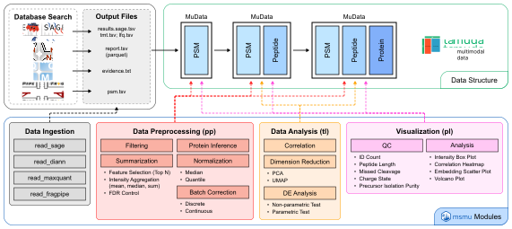

# { width="240px" }

**Python toolkit for modular and tracable LC-MS/<u>MS</u> proteomics analysis based on <u>Mu</u>Data**

## Overview

`msmu` is an open-source Python package for modular and traceable post-DB search preprocessing and statistical analysis of bottom-up proteomics data.
It supports modules for an end-to-end processing—from search output parsing through hierarchical summarization, normalization, batch correction, statistical analysis, and visualization—and leverages the highly versatile and standardized `MuData` (and `AnnData`) as a unifying, provenance-aware data container for storing annotations and representations of multi-dimensional MS data and processing history, thereby empowering reproducible pipeline and reusable data for biomarker discovery and systems biology.

{ width="100%" }

## Key Features

- **Flexible data ingestion** from Sage, DIA-NN, and other popular DB search tools
- **MuData/AnnData-compatible** object structure for organizing multi-level MS data
- **Protein inference**: infer protein groups from peptide evidence using parsimony rule
- **Normalization**: median centering, quantile normalization, etc.
- **Batch correction** for discrete and continuous variations
- **Built-in QC**: identification count, peptide length, charge, missed cleavage, intensity distribution, etc.
- **Statistical analysis**: differential expression analysis, dimensionality reduction
- **PTM data support** and stoichiometry adjustment with matched global dataset (if available)
- **Visualization**: PCA, UMAP, volcano plots, heatmaps, QC metrics

## Supporting DB Search Tools

- Sage: [https://sage-docs.vercel.app](https://sage-docs.vercel.app)
- DIA-NN: [https://github.com/vdemichev/DIA-NN](https://github.com/vdemichev/DIA-NN)
- MaxQuant: [https://www.maxquant.org/](https://www.maxquant.org/)
- FragPipe: [https://fragpipe.nesvilab.org/](https://fragpipe.nesvilab.org/)
- and more upcoming.
